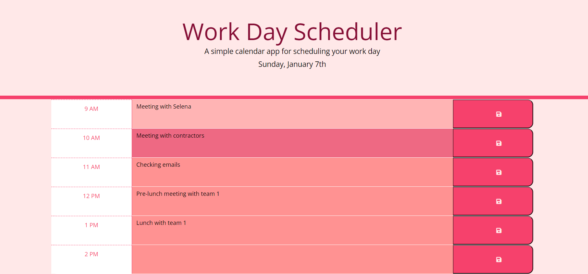
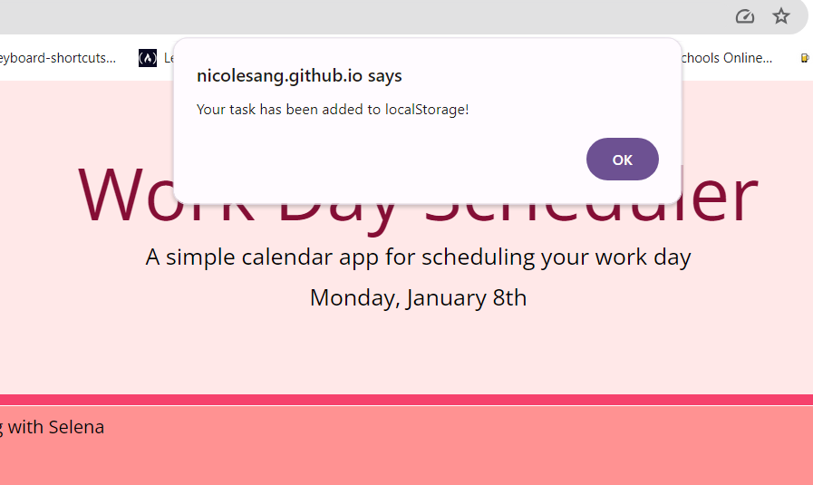

# DailyTaskLog
- This project is a dynamic workday scheduler that leverages JavaScript, jQuery, and the Day.js library to create an interactive calendar. The scheduler displays the current day with proper date suffixes and features color-coded time blocks for past, present, and future hours. Users can input and save tasks for each hour, and the events persist between page reloads using local storage.

# Usage
Deployed project URL: 
https://nicolesang.github.io/DailyTaskLog/

These screenshots shows how the scheduler looks:

To add a task, begin typing in the text area beside the corresponding time. Afterward, click the save button on the right. A pop-up will appear on your screen, confirming that your task has been successfully saved and added to the localStorage.

The saved tasks will persist in the scheduler even after refreshing the browser. The scheduler features three shades of pink: light pink represents past hours, dark pink corresponds to the current hour, and intermediate pink indicates future tasks.

## License
MIT License

Copyright (c) [2024] [Karen Nicole Santamaria Granizo]

Permission is hereby granted, free of charge, to any person obtaining a copy
of this software and associated documentation files (the "Software"), to deal
in the Software without restriction, including without limitation the rights
to use, copy, modify, merge, publish, distribute, sublicense, and/or sell
copies of the Software, and to permit persons to whom the Software is
furnished to do so, subject to the following conditions:

The above copyright notice and this permission notice shall be included in all
copies or substantial portions of the Software.

THE SOFTWARE IS PROVIDED "AS IS", WITHOUT WARRANTY OF ANY KIND, EXPRESS OR
IMPLIED, INCLUDING BUT NOT LIMITED TO THE WARRANTIES OF MERCHANTABILITY,
FITNESS FOR A PARTICULAR PURPOSE AND NONINFRINGEMENT. IN NO EVENT SHALL THE
AUTHORS OR COPYRIGHT HOLDERS BE LIABLE FOR ANY CLAIM, DAMAGES OR OTHER
LIABILITY, WHETHER IN AN ACTION OF CONTRACT, TORT OR OTHERWISE, ARISING FROM,
OUT OF OR IN CONNECTION WITH THE SOFTWARE OR THE USE OR OTHER DEALINGS IN THE
SOFTWARE.